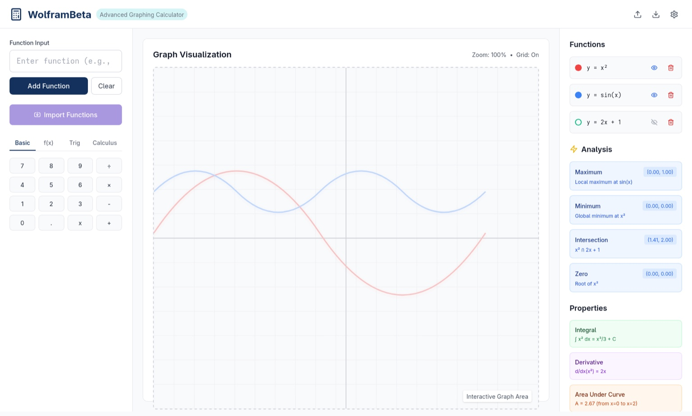

# WolframBeta

An advanced graphing calculator written in Java (Swing-based frontend). This tool enables plotting and analysis of mathematical functions with calculus support.

---

## ✨ Features

### 🔹 Graph Plotting

* Draw curves for:

  * Polynomial
  * Trigonometric
  * Algebraic
  * Logarithmic
  * Exponential
  * Step functions
* Plot multiple functions simultaneously with distinct colors
* Parse plaintext functions (optionally LaTeX-style) and plot
* Set manual limits for X and Y axes
* Pan and zoom the graph space
* Click on any curve point to display precise (x, y) values (popup or tooltip)
* Export graph as SVG (vector image)

### 🔹 Calculus and Analysis

* Calculate and display the area under the curve (definite integral)
* Compute derivatives and plot them (with detection for non-differentiable points)
* Find maxima, minima, and inflection points
* Find intersections between curves

### 🔹 Workspace Management

* Save and load workspace (functions, graph settings) as JSON
* Retain current set of functions and graph settings between sessions

---

## 📂 Project Structure

```
WolframBeta/
├── src/
│   └── main/
│       └── java/
│           └── com/
│               └── graphing/
│                   ├── GraphingCalculatorApp.java
│                   ├── ui/
│                   │   ├── MainFrame.java
│                   │   ├── GraphPanel.java
│                   │   ├── ControlPanel.java
│                   │   ├── FunctionInputPanel.java
│                   │   └── components/
│                   │       ├── CoordinateTooltip.java
│                   │       └── FunctionListRenderer.java
│                   ├── math/
│                   │   ├── Function.java
│                   │   ├── FunctionType.java
│                   │   ├── Point2D.java
│                   │   ├── parser/
│                   │   │   ├── FunctionParser.java
│                   │   │   └── ExpressionEvaluator.java
│                   │   ├── calculus/
│                   │   │   ├── DerivativeCalculator.java
│                   │   │   ├── IntegralCalculator.java
│                   │   │   └── CriticalPointFinder.java
│                   │   └── analysis/
│                   │       ├── IntersectionFinder.java
│                   │       └── FunctionAnalyzer.java
│                   ├── graph/
│                   │   ├── GraphRenderer.java
│                   │   ├── GraphSettings.java
│                   │   ├── Viewport.java
│                   │   ├── CoordinateSystem.java
│                   │   └── CurveRenderer.java
│                   ├── io/
│                   │   ├── WorkspaceManager.java
│                   │   ├── SVGExporter.java
│                   │   └── JSONSerializer.java
│                   └── utils/
│                       ├── ColorManager.java
│                       └── MathUtils.java
├── resources/
│   ├── icons/
│   └── config/
└── lib/
    └── json-simple.jar (for JSON handling)
```

---

## 🚀 Getting Started

### ✅ Prerequisites

* Java **11** (LTS)
* **json-simple 1.1.1** — Used for saving and loading workspace as JSON

### ✅ Run Locally

1. Clone the repository:

```bash
git clone https://github.com/nish3423/WolframBeta.git
cd WolframBeta
```

2. Compile and run:

```bash
javac -cp "lib/json-simple-1.1.1.jar" -d out src/main/java/com/graphing/**/*.java
java -cp "out:lib/json-simple-1.1.1.jar" com.graphing.GraphingCalculatorApp
(On Windows, replace : with ;)
```

---

## 🌐 Web Version (GitHub Pages)

This repo includes a Desmos‑style web version in the `docs/` folder.

### ✅ Run Locally (Web)

```bash
cd docs
python3 -m http.server 5173
```

Open `http://localhost:5173` in your browser.

### ✅ Enable GitHub Pages

1. Go to **Settings → Pages**
2. Set **Source** to `Deploy from a branch`
3. Select **Branch** `main` and **Folder** `/docs`
4. Save — GitHub will show the public URL

---

## 🧠 Core Class Overview

### Main Entry Point

```java
// GraphingCalculatorApp.java
public class GraphingCalculatorApp {
    public static void main(String[] args) {
        // Launch MainFrame
    }
}
````

---

### UI Layer

```java
// MainFrame.java
public class MainFrame extends JFrame {
    // Hosts GraphPanel, FunctionInputPanel, ControlPanel
}

// GraphPanel.java
public class GraphPanel extends JPanel {
    // Handles graph rendering, panning, zooming, mouse events
}

// ControlPanel.java
public class ControlPanel extends JPanel {
    // Axis limits, zoom, reset controls
}

// FunctionInputPanel.java
public class FunctionInputPanel extends JPanel {
    // Function input and list management
}

// CoordinateTooltip.java
public class CoordinateTooltip {
    // Tooltip for showing (x, y) values on hover
}

// FunctionListRenderer.java
public class FunctionListRenderer extends DefaultListCellRenderer {
    // Custom render for function list with color indicators
}
```

---

### Mathematical Engine

```java
// Function.java
public class Function {
    // Represents mathematical function with expression, color, type
}

// FunctionParser.java
public class FunctionParser {
    // Parses string input into Function objects
}

// ExpressionEvaluator.java
public class ExpressionEvaluator {
    // Evaluates parsed functions at given x
}

// DerivativeCalculator.java
public class DerivativeCalculator {
    // Computes derivatives numerically
}

// IntegralCalculator.java
public class IntegralCalculator {
    // Computes definite integrals numerically
}

// CriticalPointFinder.java
public class CriticalPointFinder {
    // Finds maxima, minima, inflection points
}

// IntersectionFinder.java
public class IntersectionFinder {
    // Computes intersections between multiple functions

// FunctionAnalyzer.java
public class FunctionAnalyzer {
    // General analysis utilities
}
```

---

### Graph Rendering Engine

```java
// GraphRenderer.java
public class GraphRenderer {
    // High-level graph drawing
}

// CurveRenderer.java
public class CurveRenderer {
    // Draws smooth curves for functions
}

// GraphSettings.java
public class GraphSettings {
    // Holds graph view parameters (axis limits, grid, zoom)
}

// Viewport.java
public class Viewport {
    // Manages panning and zoom transformations
}

// CoordinateSystem.java
public class CoordinateSystem {
    // Maps between screen space and math space
}
```

---

### IO & Utilities

```java
// WorkspaceManager.java
public class WorkspaceManager {
    // Save and load workspace (functions + settings) as JSON
}

// SVGExporter.java
public class SVGExporter {
    // Exports current graph as SVG vector image
}

// JSONSerializer.java
public class JSONSerializer {
    // Handles JSON serialization/deserialization

// ColorManager.java
public class ColorManager {
    // Manages function colors

// MathUtils.java
public class MathUtils {
    // Common math helper functions
}
```

---

## 📸 UI Mockup

> *(Based on initial frontend design in Swing)*


